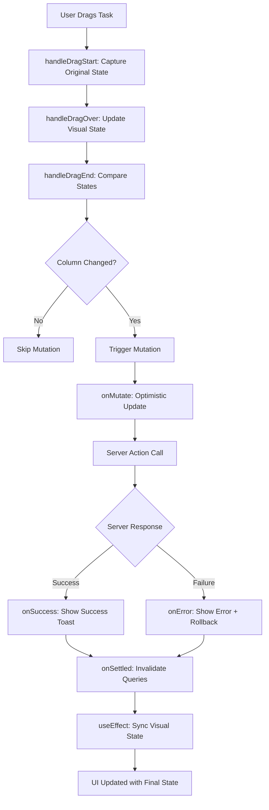

# Kanban Board Drag & Drop Data Flow Documentation

## Overview
This is an implementation of a complex, real-time kanban board with optimistic updates, proper error handling, and state synchronization. The architecture follows modern React patterns with proper separation of concerns.

## Architecture Layers

```
┌─────────────────────────────────────────────────────────────┐
│                    UI Components Layer                      │
├─────────────────────────────────────────────────────────────┤
│                   State Management Layer                    │
├─────────────────────────────────────────────────────────────┤
│                  React Query Cache Layer                    │
├─────────────────────────────────────────────────────────────┤
│                     API Routes Layer                        │
├─────────────────────────────────────────────────────────────┤
│                 Data Access Layer (DAL)                     │
├─────────────────────────────────────────────────────────────┤
│                      Database Layer                         │
└─────────────────────────────────────────────────────────────┘
```

---

## 1. Backend Data Flow

### Data Access Layer (DAL)
```typescript
// lib/data-access-layer/tasks.dal.ts

export const getTaskBoardPageData = cache(
  async (projectId: number): Promise<TaskBoardPageData> => {
    // Parallel data fetching for optimal performance
    const [project, tasks, membersResult] = await Promise.all([
      getProjectById(projectId),
      getTasksByProjectId(projectId),
      getProjectMembers(projectId),
    ]);

    return {
      project: project.data,
      tasks,           // Raw API format (TaskDTO[])
      members: membersResult?.success ? membersResult.data?.members || [] : [],
    };
  },
);
```

**Key Features:**
- **Server-side caching** with React's `cache()` function
- **Parallel data fetching** for performance optimization
- **Type safety** with DTOs (Data Transfer Objects)
- **Error boundary** with proper error handling

### API Route Layer
```typescript
// app/api/taskboard/[projectId]/route.ts

export async function GET(request: NextRequest, { params }: RouteContext) {
  try {
    const projectId = Number.parseInt(projectIdParam);
    const data = await getTaskBoardPageData(projectId);
    return NextResponse.json(data);
  } catch (error) {
    // Centralized error handling with appropriate HTTP status codes
    const status = message.includes("Authentication") ? 401 : 500;
    return NextResponse.json({ message }, { status });
  }
}
```

---

## 2. Client-Side Data Flow

### React Query Integration
```typescript
// hooks/queries/use-taskboard.ts

export function useTaskBoardData(projectId: number) {
  return useQuery({
    queryKey: queryKeys.tasks.byProjectId(projectId),
    queryFn: () => clientApi.getTaskBoardData(projectId),
    staleTime: 60 * 1000,                    // Cache for 1 minute
    placeholderData: keepPreviousData,       // Prevent loading flickers
  });
}
```

**Query Key Strategy:**
```typescript
// lib/query/query-keys.ts
export const queryKeys = {
  tasks: {
    byProjectId: (projectId: number) => ["tasks", projectId] as const,
  },
} as const;
```

### Data Transformation Pipeline
```typescript
// taskboard-client.tsx

const transformedTasks = useMemo(() => {
  if (!data?.tasks) return [];
  // Transform API format (TaskDTO) to UI format (Task)
  return data.tasks.map(transformApiTaskToUiTask);
}, [data?.tasks]);
```

**Transformation Function:**
```typescript
export function transformApiTaskToUiTask(apiTask: TaskDTO): Task {
  return {
    id: apiTask.uuid,                        // API uses uuid, UI uses id
    title: apiTask.title,
    columnId: mapApiStatusToColumnId(apiTask.status), // Status → Column mapping
    code: apiTask.task_code,
    priority: apiTask.priority,
    // ... other transformations
  };
}
```

---

## 3. Component Architecture & State Management

### TaskBoard Client (Container Component)
```typescript
// taskboard-client.tsx

export function TaskBoardClient() {
  // 1. Server state (React Query)
  const { data, isLoading, error, isFetching } = useTaskBoardData(projectId);
  
  // 2. Filter state (UI state)
  const [filters, setFilters] = useState<TaskFilters>({
    searchTerm: "", assigneeIds: [], labels: [], priority: null,
  });
  
  // 3. Visual state (optimistic UI)
  const [visualTasks, setVisualTasks] = useState<Task[]>([]);
  
  // 4. Modal state
  const [isModalOpen, setIsModalOpen] = useState(false);
}
```

**State Synchronization Strategy:**
```typescript
// Sync server state → visual state
useEffect(() => {
  setVisualTasks(transformedTasks);
}, [transformedTasks]);

// Additional sync for mutation responses
useEffect(() => {
  if (data?.tasks && !isFetching) {
    const newTransformedTasks = data.tasks.map(transformApiTaskToUiTask);
    setVisualTasks(newTransformedTasks);
  }
}, [data?.tasks, isFetching]);
```

### KanbanBoard (Presentation Component)
```typescript
// kanban-board.tsx

export default function KanbanBoard({
  initialData,        // Server data snapshot
  onVisualTasksChange // Callback to update parent's visual state
}) {
  // Drag state management
  const [activeTask, setActiveTask] = useState<Task | null>(null);
  const [dragStartColumnId, setDragStartColumnId] = useState<KanbanColumnId | null>(null);
}
```

---

## 4. Drag & Drop Flow (The Heart of the System)

### Phase 1: Drag Start
```typescript
const handleDragStart = (event: DragStartEvent) => {
  const task = tasks.find((t) => t.id === active.id);
  
  if (task) {
    setActiveTask(task);                    // For drag overlay
    setDragStartColumnId(task.columnId);    // Capture ORIGINAL state
    
    console.log("Drag started:", {
      taskId: task.id,
      originalColumn: task.columnId
    });
  }
};
```

**Key Insight:** We capture the original column ID separately to prevent mutation during drag operations.

### Phase 2: Drag Over (Real-time Visual Updates)
```typescript
const handleDragOver = (event: DragOverEvent) => {
  // Update parent's visual state immediately for smooth UX
  onVisualTasksChange((prevTasks) => {
    const activeIndex = prevTasks.findIndex((t) => t.id === activeId);
    
    if (isOverAColumn) {
      // Moving to empty column
      prevTasks[activeIndex].columnId = overColumnId;
      return arrayMove(prevTasks, activeIndex, prevTasks.length - 1);
    }
    
    if (isOverATask) {
      // Moving over another task
      if (prevTasks[activeIndex].columnId !== overTask.columnId) {
        // Cross-column move
        prevTasks[activeIndex].columnId = overTask.columnId;
        return arrayMove(prevTasks, activeIndex, overIndex);
      }
      // Same-column reorder
      return arrayMove(prevTasks, activeIndex, overIndex);
    }
    
    return prevTasks;
  });
};
```

**Visual Update Strategy:**
- **Immediate UI response** (no waiting for server)
- **Optimistic updates** to parent state
- **Array reordering** with DnD Kit's `arrayMove`

### Phase 3: Drag End (Server Synchronization)
```typescript
const handleDragEnd = (event: DragEndEvent) => {
  // 1. Capture original state BEFORE clearing
  const originalColumnId = dragStartColumnId;
  
  // 2. Clear drag states
  setActiveTask(null);
  setDragStartColumnId(null);
  
  // 3. Get final visual state
  let finalColumnId: KanbanColumnId | null = null;
  onVisualTasksChange((currentTasks) => {
    const finalTask = currentTasks.find((t) => t.id === active.id);
    finalColumnId = finalTask?.columnId || null;
    return currentTasks; // Read-only access
  });
  
  // 4. Compare and trigger mutation if needed
  if (originalColumnId !== finalColumnId) {
    updateTaskStatus({
      taskId: active.id as string,
      newStatus: finalColumnId,
      projectId,
      projectSlug,
    });
  }
  
  // 5. Final reordering
  onVisualTasksChange((currentTasks) => {
    // Recalculate order indices for all tasks
    const finalTasks: Task[] = [];
    for (const column of columns) {
      const tasksInColumn = currentTasks
        .filter((task) => task.columnId === column.id)
        .map((task, index) => ({ ...task, order: index }));
      finalTasks.push(...tasksInColumn);
    }
    return finalTasks;
  });
};
```

---

## 5. Mutation & Optimistic Updates

### React Query Mutation Setup
```typescript
const { mutate: updateTaskStatus } = useMutation({
  mutationFn: updateTaskStatusAction,
  
  // Phase 1: Optimistic Update
  onMutate: async (variables) => {
    // Cancel ongoing queries to prevent race conditions
    await queryClient.cancelQueries({
      queryKey: queryKeys.tasks.byProjectId(projectId),
    });

    // Snapshot current state for rollback
    const previousData = queryClient.getQueryData<TaskBoardPageData>(
      queryKeys.tasks.byProjectId(projectId),
    );

    // Apply optimistic update to React Query cache
    queryClient.setQueryData<TaskBoardPageData>(
      queryKeys.tasks.byProjectId(projectId),
      (oldData) => {
        if (!oldData) return undefined;

        const newTasks = oldData.tasks.map((task) =>
          task.uuid === variables.taskId
            ? { ...task, status: variables.newStatus.toLowerCase() as TaskStatus }
            : task,
        );

        return { ...oldData, tasks: newTasks };
      },
    );

    return { previousData }; // Return for rollback
  },

  // Phase 2: Handle Server Response
  onSuccess: (result) => {
    if (result.success) {
      toast.success(result.message || "Task updated successfully!");
    } else {
      toast.error(result.message || "Failed to update task");
      // Revert on server-side failure
      queryClient.invalidateQueries({
        queryKey: queryKeys.tasks.byProjectId(projectId),
      });
    }
  },

  // Phase 3: Handle Network Errors
  onError: (err, variables, context) => {
    toast.error(`Failed to move task: ${err.message}`);
    
    // Rollback optimistic update
    if (context?.previousData) {
      queryClient.setQueryData(
        queryKeys.tasks.byProjectId(projectId),
        context.previousData,
      );
    }
  },

  // Phase 4: Final Cleanup
  onSettled: () => {
    // Always refetch to ensure consistency with server
    queryClient.invalidateQueries({
      queryKey: queryKeys.tasks.byProjectId(projectId),
    });
  },
});
```

---

## 6. Error Handling & Recovery

### Server Action with Simulated Failures
```typescript
// actions/dashboard/tasks.action.ts

export async function updateTaskStatusAction(input) {
  try {
    // Simulate 50% failure rate for testing
    if (Math.random() > 0.5) {
      return {
        success: false,
        status: 500,
        data: null,
        message: "Simulated server failure!",
      };
    }

    // Simulate network delay
    await new Promise(resolve => setTimeout(resolve, 1000));

    return {
      success: true,
      data: null,
      status: 200,
      message: "Task updated successfully.",
    };
  } catch (error) {
    return handleApiError(error, "Failed to update task.");
  }
}
```

### Recovery Strategies
1. **Optimistic Update:** UI responds immediately
2. **Success:** Show success toast, keep optimistic state
3. **Server Failure:** Show error toast, revert via query invalidation
4. **Network Failure:** Show error toast, manual rollback to previous state
5. **Final Sync:** Always invalidate queries to ensure consistency

---

## 7. Data Flow Summary



## 8. Performance Optimizations

### 1. **Memoization Strategy**
```typescript
const tasksByColumn = useMemo(() => {
  return columns.reduce((acc, column) => {
    acc[column.id] = tasks
      .filter((task) => task.columnId === column.id)
      .sort((a, b) => a.order - b.order);
    return acc;
  }, {} as Record<KanbanColumnId, Task[]>);
}, [tasks, columns]);
```

### 2. **Debounced Search**
```typescript
const handleSearchChange = useDebouncedCallback((searchTerm: string) => {
  onFilterChange({ ...filters, searchTerm });
}, 300);
```

### 3. **Optimistic Updates**
- No loading states during drag operations
- Immediate visual feedback
- Background server synchronization

### 4. **Query Optimization**
```typescript
staleTime: 60 * 1000,           // Cache for 1 minute
placeholderData: keepPreviousData, // Prevent loading flickers
```

---

## 9. State Management Patterns

### Multi-Layer State Architecture
```typescript
// Layer 1: Server State (React Query)
const { data } = useTaskBoardData(projectId);

// Layer 2: Derived State (Transformations)
const transformedTasks = useMemo(() => 
  data?.tasks.map(transformApiTaskToUiTask), [data?.tasks]
);

// Layer 3: Visual State (Optimistic UI)
const [visualTasks, setVisualTasks] = useState<Task[]>([]);

// Layer 4: UI State (Filters, Modals)
const [filters, setFilters] = useState<TaskFilters>({});
```

### State Synchronization Points
1. **Server → Transformed:** API data transformation
2. **Transformed → Visual:** Initial load and mutation responses
3. **Visual → UI:** Filter application and search
4. **Drag Operations:** Real-time visual updates
5. **Mutation Results:** Optimistic updates and rollbacks

---

## 10. Key Design Decisions & Rationale

### 1. **Separate Visual State Management**
**Decision:** Maintain separate `visualTasks` state in parent component
**Rationale:** 
- Enables optimistic updates without affecting server state
- Allows rollback on failures
- Provides smooth drag and drop experience

### 2. **Drag Start Column Tracking**
**Decision:** Store `dragStartColumnId` separately from `activeTask`
**Rationale:**
- Prevents mutation of original state during drag operations
- Enables accurate comparison for triggering mutations
- Solves React state timing issues

### 3. **React Query Optimistic Updates**
**Decision:** Update query cache directly in `onMutate`
**Rationale:**
- Provides immediate feedback across all components
- Leverages React Query's built-in rollback mechanisms
- Maintains consistency with other parts of the application

### 4. **Callback-Based State Updates**
**Decision:** Use `onVisualTasksChange` callback pattern
**Rationale:**
- Maintains single source of truth in parent component
- Enables coordination between drag operations and other UI updates
- Follows React's data-down, actions-up pattern

---

## 11. Testing Considerations

### Areas for Unit Testing
```typescript
// Data transformation
describe('transformApiTaskToUiTask', () => {
  it('should map API status to column ID correctly', () => {
    // Test status mapping logic
  });
});

// State synchronization
describe('TaskBoardClient', () => {
  it('should sync visual state when server data changes', () => {
    // Test useEffect synchronization
  });
});

// Drag and drop logic
describe('KanbanBoard drag operations', () => {
  it('should capture original column on drag start', () => {
    // Test drag start logic
  });
  
  it('should trigger mutation only when column changes', () => {
    // Test drag end comparison logic
  });
});
```

### Integration Testing Scenarios
1. **Happy Path:** Successful drag and drop with server update
2. **Server Failure:** Failed mutation with proper rollback
3. **Network Error:** Connection failure with error handling
4. **Concurrent Updates:** Multiple users updating same task
5. **Filter Interactions:** Drag and drop with active filters

---

### Advanced Patterns Implemented:

1. **Compound State Management:** Managing visual, server, and drag states simultaneously
2. **Optimistic UI with Rollback:** Complex state synchronization with error recovery
3. **Real-time Visual Updates:** Immediate UI response with background sync
4. **Multi-layer Caching:** Server-side, React Query, and component-level caching
5. **Complex Event Handling:** Drag and drop with proper state management

### Future Enhancement Opportunities:

1. **Real-time Updates:** WebSocket integration for multi-user scenarios
2. **Offline Support:** Service worker for offline functionality  
3. **Undo/Redo:** Command pattern for action history
4. **Batch Operations:** Multiple task updates in single API call
5. **Virtual Scrolling:** For handling thousands of tasks
6. **Keyboard Shortcuts:** Power user features
7. **Drag Animations:** Enhanced visual feedback
8. **Auto-save Drafts:** For task creation/editing
9. **Collaborative Cursors:** Real-time user presence
10. **Audit Trail:** Task change history tracking

---